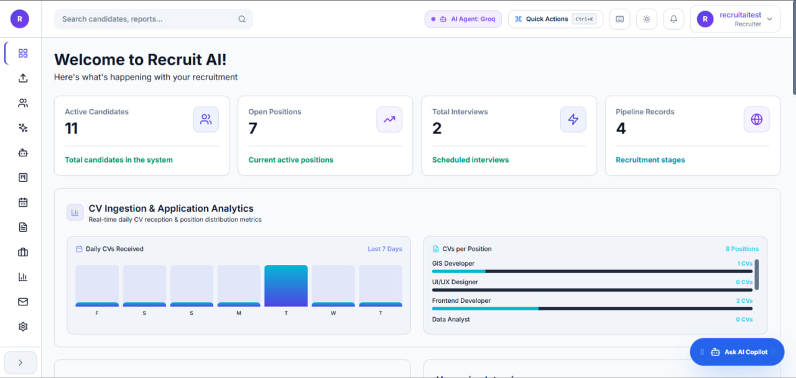
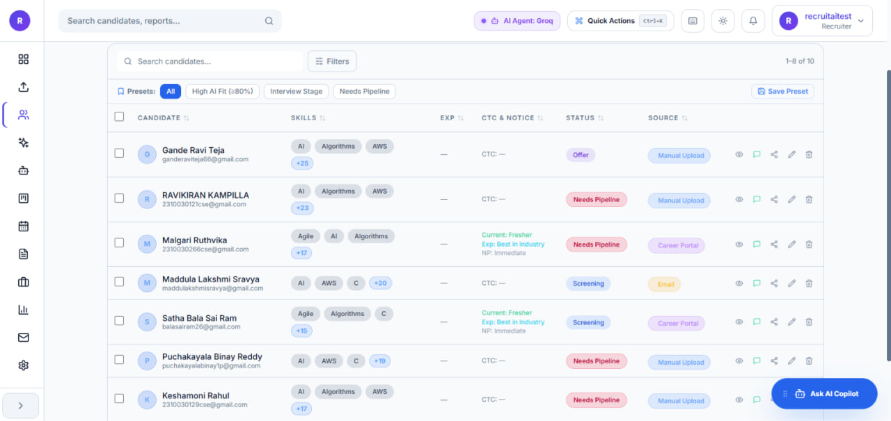
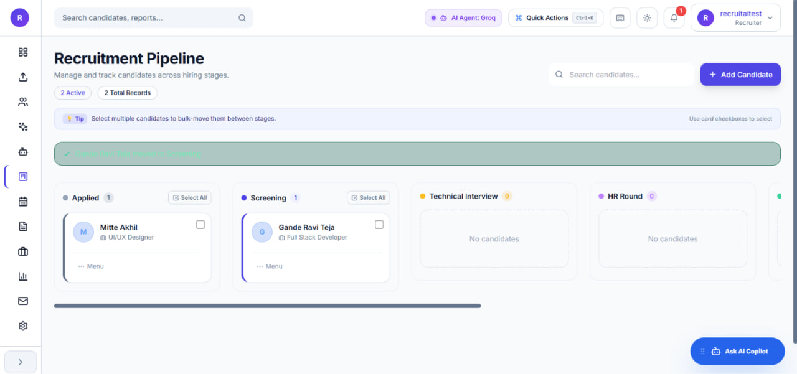
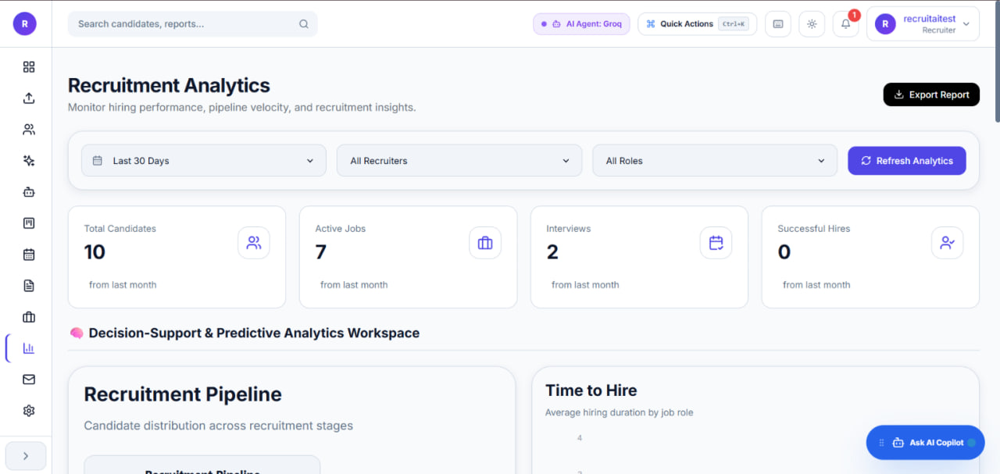

# AI Recruitment Platform

> AI-powered recruitment management platform that automates resume parsing, candidate screening, intelligent search, and end-to-end hiring workflows.

**Live Demo:** https://ai-recruitment-platform.centralindia.cloudapp.azure.com

---

## Overview

AI Recruitment Platform is a production-oriented full-stack application designed to streamline modern hiring. The platform enables recruiters to upload resumes, automatically extract candidate information using AI-assisted document parsing, manage applicants through an interactive hiring pipeline, schedule interviews, and monitor recruitment performance through analytics dashboards.

Built with **Next.js**, **FastAPI**, **PostgreSQL**, **Redis**, and modern authentication practices, the project demonstrates scalable full-stack architecture and AI-assisted document processing.

---

## The Problem

Recruitment teams often spend hours manually reviewing resumes, organizing applicant information, and tracking candidates across different hiring stages. As applicant volume grows, traditional recruitment workflows become increasingly inefficient and difficult to manage.

This platform addresses those challenges by:

- Automating resume information extraction
- Centralizing candidate and position management
- Supporting intelligent candidate search
- Managing interview scheduling
- Tracking hiring progress with Kanban workflows
- Visualizing recruitment analytics
- Securing access through role-based authentication

---

## Key Features

### Authentication & Security

- JWT Authentication
- Role-Based Access Control (RBAC)
- Multi-Factor Authentication (MFA)
- Email Verification
- Protected Routes

### Candidate Management

- Resume Upload (PDF & DOCX)
- AI Resume Parsing
- OCR Support for Scanned Resumes
- Duplicate Resume Detection
- Candidate CRUD Operations
- Skills & Education Extraction

### Recruitment Workflow

- Position Management
- Kanban Hiring Pipeline
- Interview Scheduling
- Recruiter Dashboard
- Analytics & Hiring Insights

### AI Capabilities

- Intelligent Resume Parsing
- OCR Document Processing
- Semantic Search Architecture
- Candidate Matching Framework

---

## Tech Stack

| Layer | Technologies |
|--------|-------------|
| **Frontend** | Next.js, React, TypeScript |
| **UI** | Tailwind CSS, shadcn/ui, Framer Motion |
| **Backend** | FastAPI, Python |
| **Database** | PostgreSQL |
| **Authentication** | JWT, RBAC, MFA |
| **AI** | Resume Parsing, OCR |
| **Background Jobs** | Redis, Celery |
| **Deployment** | Azure VM, Docker, Vercel |

---

## System Architecture

### High-Level Flow

1. Recruiter uploads a resume.
2. FastAPI validates the document.
3. AI parser extracts structured candidate data.
4. OCR processes scanned resumes when necessary.
5. Candidate information is stored in PostgreSQL.
6. Recruiters search, filter, and manage applicants.
7. Analytics dashboard provides hiring insights.

---

## Application Workflow

```text
Recruiter
    │
    ▼
Upload Resume
    │
    ▼
FastAPI Backend
    │
    ├── Resume Parser
    ├── OCR Engine
    └── Duplicate Detection
    │
    ▼
PostgreSQL Database
    │
    ▼
Recruiter Dashboard
    │
    ├── Candidate Management
    ├── Hiring Pipeline
    ├── Interview Scheduling
    └── Analytics
```

---

## Project Structure

```text
AI-Recruitment-Platform
│
├── Backend
│   ├── api
│   ├── models
│   ├── schemas
│   ├── services
│   ├── core
│   └── main.py
│
├── Frontend
│   ├── app
│   ├── components
│   ├── services
│   ├── hooks
│   └── lib
│
├── Redis
├── k8s
├── docker-compose.yml
└── nginx_default.conf
```

---

## Screenshots

### Dashboard



### Candidate Management



### Hiring Pipeline



### Analytics Dashboard



---

## REST API Overview

| Module | Description |
|---------|-------------|
| **Authentication** | Login, Signup, MFA, Email Verification |
| **Candidates** | Resume Upload, Parsing, CRUD, Search |
| **Positions** | Job Position Management |
| **Pipeline** | Kanban Hiring Workflow |
| **Interviews** | Schedule & Manage Interviews |
| **Analytics** | Dashboard Metrics & Insights |

---

## Getting Started

### Prerequisites

- Node.js 20+
- Python 3.11+
- PostgreSQL
- Redis

### Backend Setup

```bash
cd Backend

python -m venv venv

# Windows
venv\Scripts\activate

# Linux / macOS
source venv/bin/activate

pip install -r requirements.txt

uvicorn main:app --reload
```

### Frontend Setup

```bash
cd Frontend

npm install

npm run dev
```

### Environment Variables

Create a `.env` file inside the `Backend` directory.

```env
DATABASE_URL=your_database_url
JWT_SECRET=your_secret
REDIS_URL=your_redis_url
GOOGLE_CLIENT_ID=your_client_id
SMTP_USERNAME=your_email
SMTP_PASSWORD=your_password
```

> Never commit environment variables or credentials to GitHub.

---

## Security

- JWT-based authentication
- Role-Based Authorization
- Password hashing
- Email verification
- Multi-Factor Authentication
- Request validation using FastAPI schemas
- Environment variable protection

---

## Future Improvements

- Vector-based Semantic Search
- Job Description Matching
- Microsoft Graph Mailbox Integration
- AI Interview Assistant
- GitHub Actions CI/CD
- Monitoring & Observability
- Production Logging

---

## Author

**Pakki Nithish**

- GitHub: https://github.com/PakkiNithish
- Portfolio: https://pakkinithish-portfolio.vercel.app
- LinkedIn: https://linkedin.com/in/pakki-nithish

---

⭐ If you found this project interesting, consider starring the repository.
